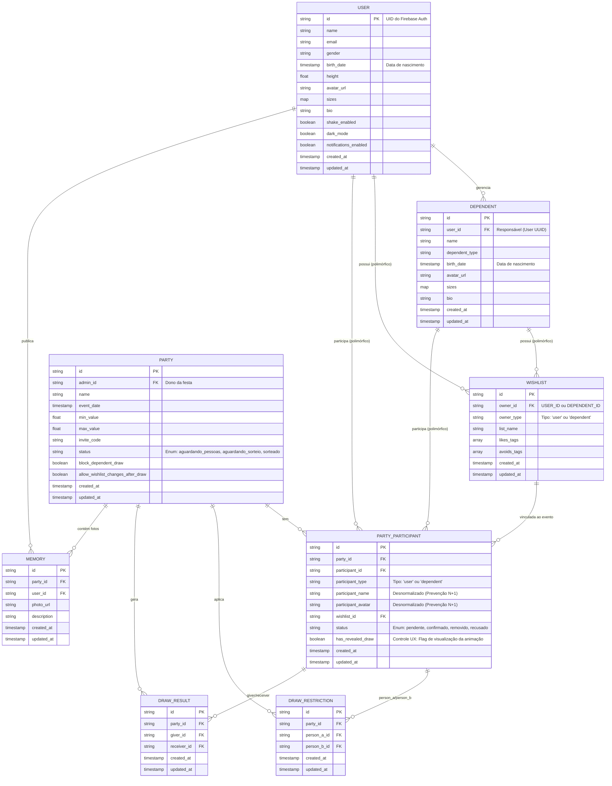

# Documento de Arquitetura de Dados: ShakeIT

Este documento descreve as diretrizes arquiteturais e o modelo de dados do **ShakeIT**. Como Arquiteto de Software Líder do projeto, meu objetivo aqui é documentar de forma clara e rigorosa as decisões de engenharia adotadas na estruturação da nossa base de dados principal, o Firebase Firestore (NoSQL cloud database), bem como as estratégias de persistência local utilizando o AsyncStorage.

Nossa arquitetura visa assegurar a escalabilidade do sistema, a integridade transacional das operações, a segurança de dados e uma experiência de usuário (UX) robusta, fluida e com fortes capacidades offline-first.

---

## 1. Banco de Dados Principal: Firebase Firestore (NoSQL)

O Firestore é um banco orientado a documentos. O diagrama de Entidade-Relacionamento abaixo ilustra nosso modelo conceitual de negócio. Na implementação técnica, fazemos uso intensivo de desnormalização, mapas nativos e esquemas polimórficos apropriados para o ambiente NoSQL.

## 2. Decisões de Engenharia no Firestore

Para otimizar o desempenho, minimizar os custos de leitura e prever cenários complexos de negócio, toda a equipe de desenvolvimento deve seguir rigorosamente as seguintes diretrizes:

### 2.1. Precisão Temporal com `birth_date`
Substituímos o campo de inteiro `birth_year` para `birth_date` (tipo *Timestamp*) nas coleções `USER` e `DEPENDENT`. Esta transição nos permite executar validações matemáticas exatas de idade e data no Frontend (ex: para liberar recursos específicos para maiores de idade, ou notificar aniversários), abandonando aproximações rudimentares.

### 2.2. Máquina de Estados e Ciclo de Vida do App (Status em Português)
Adequamos as enumerações de `status` em nossas tabelas para português, de forma a criar uma aderência total entre o código e nossa jornada de negócio.
- Em `PARTY`, a festa inicia em `"aguardando_pessoas"` (bloqueada até ter 3 participantes). Ao atingir o quórum mínimo e antes do sorteio rodar, ela transita para `"aguardando_sorteio"`. Após o backend concluir o processamento, o status final é cravado em `"sorteado"`.
- Em `PARTY_PARTICIPANT`, temos o Soft Delete (explicação abaixo) consolidado. Os status disponíveis são `"pendente"`, `"confirmado"`, `"removido"` (expulso pelo admin) e `"recusado"` (quando o participante desiste do convite).

### 2.3. Remoção Lógica (Soft Deletes)
É terminantemente proibido executar operações de *delete* destrutivo no banco de dados para remover um usuário ou um dependente de uma festa. Para isso, nosso campo de `status` na entidade `PARTY_PARTICIPANT` recebe os valores `"removido"` ou `"recusado"`. Esta prática garante que todo o histórico e a logística de convites e restrições da festa permaneçam auditáveis.

### 2.4. Desnormalização de Dados (Prevenção de N+1 Queries)
Sendo o Firestore um banco que não realiza `JOINs`, listar os participantes de uma festa exigiria (N) queries a mais para buscar nomes e avatares. Mitigamos esse problema (conhecido como N+1 Queries) gravando `participant_name` e `participant_avatar` nativamente no documento `PARTY_PARTICIPANT`. Nossa tela de listagem renderiza os usuários com apenas *uma* única consulta.

### 2.5. Campos de Auditoria (Timestamps)
É mandatório em nosso schema que todas as entidades possuam as propriedades `created_at` e `updated_at`. Timestamps são o alicerce para ordenar listas cronologicamente (quem entrou mais recente na festa) e indispensáveis na rastreabilidade de bugs de concorrência ou sobrescrita no frontend.

### 2.6. Firestore Security Rules (Proteção de Dados Sensíveis)
Como lidamos com o sigilo do Amigo Secreto (quem tirou quem), as Regras de Segurança (Security Rules) do Firestore devem ser escritas de forma rigorosa. A configuração deve proibir que um usuário mal-intencionado no front-end faça uma query aberta (ex: `collection('DRAW_RESULT').where('party_id', '==', id)`) para extrair a lista inteira do sorteio. A regra imposta deve ser estrita: o usuário só terá permissão de leitura sobre um documento da coleção `DRAW_RESULT` se o seu próprio ID de autenticação (ou o do seu dependente) corresponder aos campos `giver_id` ou `receiver_id`.

### 2.7. Índices Compostos (Composite Indexes)
Em nossa arquitetura, o `status` e as restrições da festa ditam muitas regras. Quando o Frontend executar consultas estruturadas combinando filtros lógicos com ordenação temporal (ex: `where('party_id', '==', id).orderBy('created_at')`), o mecanismo do Firestore exigirá a existência de **Índices Compostos**. Como boa prática para a equipe: sempre que um erro surgir no terminal do Expo avisando sobre a ausência de um index e fornecendo um URL gerado pelo Firebase, o desenvolvedor deve obrigatoriamente clicar no link e aprovar a criação do índice na aba de Indexes do console.

---

## 3. Logística do Sorteio (Firebase Cloud Functions)

A inteligência matemática por trás do Amigo Secreto transita inteiramente para o Backend usando as **Firebase Cloud Functions**. Isso atende a três pilares arquiteturais inegociáveis:

*   **Segurança (Anti-Cheat):** O processamento do algoritmo ocorre oculto no servidor. É tecnicamente impossível que o organizador utilize engenharia reversa no front-end para interceptar o fluxo da requisição e descobrir quem tirou quem antes da hora. Segredo absoluto.
*   **Integridade Transacional (Batch Writes):** O ato do sorteio manipula muitos documentos ao mesmo tempo (`DRAW_RESULT` e `PARTY`). As Cloud Functions operam tudo dentro de uma transação atômica em lote (Batch Writes). Se a internet do organizador cair exatamente no momento que ele clicar em "Sortear", não tem problema. O servidor conclui a operação sem corromper o banco.
*   **Limite Estrito Arquitetural:** O Firestore tem um limite natural de 500 operações por Batch Write. Tendo em vista que cada usuário afeta até 2 documentos na hora do sorteio, impomos a limitação lógica máxima e travada no código de **100 participantes por festa**, resguardando estabilidade e performance.

---

## 4. Persistência Local e Estratégia de Caching (AsyncStorage)

Nossa UI se sustenta no padrão **MVVM**, onde o **AsyncStorage** funciona como uma camada de cache robusta com as seguintes atribuições:

1.  **Cache Visual e Configurações (UX):** Flags locais de `dark_mode` ou `shake_enabled` são extraídas instantaneamente ao iniciar o app, eliminando engasgos (flickering) entre os temas claro e escuro.
2.  **Restauração Expressa (Sessão Rápida):** Armazenamos nome e avatar básico da sessão localmente para contornar o *Cold Start* das queries lentas e dar uma sensação de aplicativo verdadeiramente nativo.
3.  **Resiliência Offline:** O Amigo Secreto sempre ocorre em lugares inóspitos de conectividade. Uma vez que o app baixa a confirmação visual do amigo secreto (após a festa ter o status `"sorteado"` e o usuário online visualizar o resultado), cacheamos o documento `DRAW_RESULT` inteiro. Sem 4G/Wi-Fi na hora de entregar o presente? Tudo certo, o AsyncStorage provê os dados do destinatário com fluidez.

---

## 5. Engenharia de Experiência e UI (User Experience)

### 5.1. Controle Lógico da Animação de Revelação (O campo `has_revealed_draw`)
Adicionamos o booleano `has_revealed_draw` ao `PARTY_PARTICIPANT`. A premissa técnica aqui é blindar a retenção dos usuários. O usuário *só* verá a tela com a animação interativa para chacoalhar (Shake) o dispositivo celular de forma inédita. Ao concluir a animação e ver quem tirou, essa flag vira `true`. A partir daí, se ele fechar e abrir o app e entrar na mesma festa, ele navegará magicamente direto para o perfil estático e informações do seu sorteado, extinguindo qualquer frustração repetitiva de ter que chacoalhar novamente para conferir as tags ou as listas do amigo.

### 5.2. UX para Dependentes (Navegação por Abas)
Temos a figura do usuário "Responsável" gerindo menores de idade ou pets (Dependentes) no sorteio. Quando esse usuário titular entra no app após um evento estar como `"sorteado"`, estabeleço como regra de ouro a eliminação do ruído gestual.

**A regra é:** O titular chacoalha o celular **apenas UMA vez**.

Na tela que sucede a vibração de sucesso do celular, exibiremos os resultados encapsulados através de navegação superior (Tabs ou Topbar Routing).
- **Aba 1:** `Meu Sorteio` (O titular visualiza quem ele tirou).
- **Aba 2:** `Sorteio do Filho` (O titular vê quem seu dependente tirou).
- **Aba 3:** `Sorteio do Pet` (Caso esteja).

Com isso, processamos e mudamos a flag de múltiplos `has_revealed_draw` vinculados ao mesmo dispositivo de uma só vez, poupando a mão do nosso usuário titular e provendo uma experiência premium e intuitiva.

---
*Documentação oficial de arquitetura e modelo de dados, gerida pela Liderança Técnica do ShakeIT.*
